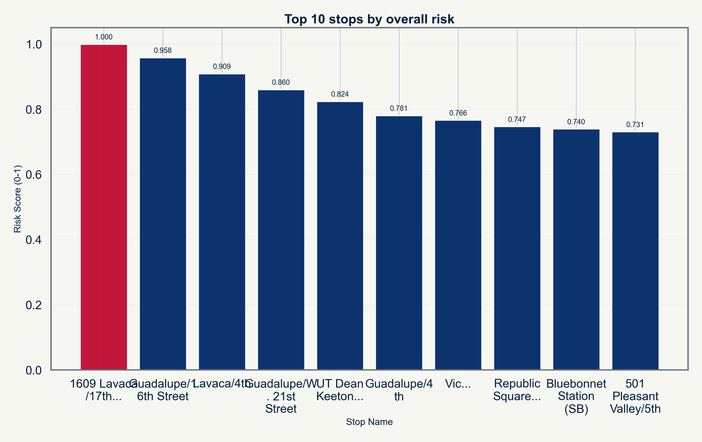

<!-- markdownlint-disable -->

# CMTA + City of Austin Transit Baseline
## Section 1 Presentation Packet
### Section A - Amenity Conditions: What Riders Are Missing Right Now

Date: April 18, 2026  
Prepared for: Agenda submission and Section 1 presentation

---

## 1) Section Scope for This Presentation
This packet is intentionally limited to the first section of the analysis:

- Section A - Amenity Conditions: What Riders Are Missing Right Now

Use this packet when you only need to present the opening evidence block and not the full multi-section analysis.

---

## 2) Agenda Submission Ready Summary
### Agenda Item Title
Transit Stop Amenity Conditions at High-Priority Stops (Baseline Section 1)

### Requested Discussion Focus
- Baseline evidence on shelter and bench gaps at high-priority stops.
- Immediate implications for rider safety, accessibility, and service quality.
- Initial corrective-action framing for next meeting cycle.

### Time Allocation (Suggested)
- 1 minute: Why this section matters.
- 2 minutes: Core metrics and evidence.
- 2 minutes: Top stop examples and risk concentration.
- 1 minute: Immediate ask.

---

## 3) Core Numbers to Repeat Verbatim
- 80% of high-priority stops are missing shelter.
- 64% of high-priority stops are missing benches.
- All analyzed high-priority stops in this section show significant amenity deficits.

Primary source: output/tables/evidence_matrix.csv

---

## 4) First-Section Narrative (Presentation Copy)
### Finding
The stops serving the most riders are among the worst-equipped in the system.

The high-priority stops were assessed against two baseline amenities: shelter and benches. For transit-dependent riders, these are functional necessities.

- 80% of high-priority stops are missing shelter entirely.
- 64% are missing benches entirely.

### Why This Matters
At locations with high service activity, missing shelter and seating increase weather exposure, standing burden, and accessibility risk.

### Priority Stop Examples to Name
1. 1609 Lavaca/17th (Midblock)
2. Guadalupe/16th Street
3. Lavaca/4th
4. Guadalupe/W. 21st Street
5. UT Dean Keeton Station (NB)

---

## 5) Section 1 Slide Content (Ready to Present)
### Slide Title
High-Demand Stops Have Large Amenity Gaps

### On-slide bullets
- 80% of high-priority stops are missing shelter.
- 64% of high-priority stops are missing benches.
- Basic rider protections are missing where service is concentrated.

### Speaker Notes
- This is a baseline built from reproducible public data.
- These are not fringe stops; these are high-service locations.
- The first action threshold is straightforward: close shelter and bench gaps at top-risk stops.

---

## 6) Visual for Section 1
Recommended chart:

Figure source: output/figures/top10_risk_stops_bar.png

---

## 7) Immediate Ask (Section 1 Only)
1. Approve targeted shelter and bench corrective action at top-risk stops.
2. Require monthly progress reporting on shelter and bench installation status.
3. Carry unresolved amenity gaps forward as standing agenda items until corrected.

---

## 8) Source Materials Included in This Packet
- reports/Qualitative_Summary.md (Section A)
- PRESENTATION_PACK.md (Slides 1-4 content alignment)
- reports/CMTA_20_Minute_Presenter_Cheat_Sheet.md (opening and concern framing)
- output/tables/evidence_matrix.csv
- output/tables/top10_high_risk_stops_table.csv
- output/figures/top10_risk_stops_bar.png

---

<!-- ameritech-attribution -->
*Tiffany Moore  •  Ameritech Consulting Group  •  [tiffany@a-techconsulting.com](mailto:tiffany@a-techconsulting.com)  •  [www.a-techconsulting.com](https://www.a-techconsulting.com)  •  [GitHub](https://github.com/ameritechconsulting/cmta-analysis)*
